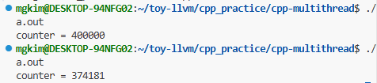

cpp에서 스레드를 다룬다고 하면, thread랑 mutex 헤더를 사용한다.

```cpp
#include <iostream>
#include <thread>
#include <vector>

int counter = 0;

void increment() {
    for (int i = 0; i < 100000; i++) {
        counter++;
    }
}

int main() {
    std::vector<std::thread> threads;

    for (int i = 0; i < 4; i++) {
        threads.emplace_back(increment);
    }

    for (auto& t : threads) {
        t.join();
    }

    std::cout << "counter = " << counter << std::endl;

    return 0;
}
```

이게 왜 문제?

400000이 나올수도, 안나올수도 있다



공유 자원인 counter++가 원자적이지 않기 때문에 발생한 문제다.

여러 스레드가 동일한 counter에 접근해서 레이스 컨디션이 발생하면 10 -> 11 -> 12 대로 증가하는게 아니라 10, 10 -> 11로 증가하게 된다.

그래서 일단 mutex로 해결할 수 있다.

lock이라고 생각해도 되고, 화장실 열쇠같은거로 생각해도 된다.

```cpp
int counter = 0;
std::mutex mtx;

void increment() {
    for (int i = 0; i < 100000; i++) {
        mtx.lock();
        counter++;
        mtx.unlock();
    }
}
```

mutex 변수를 만들고, counter연산 전에 lock 걸고 연산 후 풀어준다.

문제는 lock이후 예외가 발생해서 작업이 멈추게 되면, unlock이 호출되지않을 가능성이 존재한다는 점이다.

그래서 lock, unlock 쌍 대신 lock_guard를 쓰는 것 같다.

```cpp
std::mutex mtx;

void increment() {
    for (int i = 0; i < 100000; i++) {
        std::lock_guard<std::mutex> lock(mtx);
        counter++;
    }
}
```

lock_guard 객체가 생성될때 mutex를 잠그는데, 스코프(임계구역)를 벗어나면 알아서 unlock된다.

## 공유 큐?

counter로 멀티 쓰레드 환경에서 공유자원을 어떻게 관리하는 지에 대해 간단히 알아봤으니 조금 더 심화로 가보자.

```cpp
#include <iostream>
#include <thread>
#include <vector>
#include <queue>
#include <mutex>

std::queue<int> tasks;
std::mutex mtx;

void worker(int workerId) {
    while (true) {
        int task;

        {
            std::lock_guard<std::mutex> lock(mtx);

            if (tasks.empty()) {
                break;
            }

            task = tasks.front();
            tasks.pop();
        }

        std::cout << "worker " << workerId
                  << " processed task " << task << std::endl;
    }
}

int main() {
    for (int i = 1; i <= 20; i++) {
        tasks.push(i);
    }

    std::vector<std::thread> workers;

    for (int i = 0; i < 4; i++) {
        workers.emplace_back(worker, i);
    }

    for (auto& t : workers) {
        t.join();
    }

    return 0;
}
```

이건 작업 큐로, 여러 스레드가 하나의 큐에서 작업을 꺼내 처리하는 구조다. 큐도 지금 보면 공유자원으로 선언되어있다.

큐에서 꺼내는 작업은 lock_guard로 보호해줬는데, task 자체는 scope 밖에서 처리한다.

그럼 어떻게 해결??

단순히 worker print를 스코프 안으로 땡기기? 

그러면 그 작업하는 동안 다른 스레드가 대기하게 된다.

만약 저게 단순 print가 아니라 오래걸리는 io작업이었으면 그거 끝날때까지 다른 스레드들도 대기하고 있는 게 된다.

그래서 반드시 mutex로 잠글 때는 최소 범위만 잠가야한다.

예시 코드를 실행하면

```cpp
worker worker 0 processed task 1
worker 0 processed task 3
worker 0 processed task 5
worker 0 processed task 7
worker 0 processed task 8
worker 0 processed task 9
worker 0 processed task 10
worker 0 processed task 11
worker 0 processed task 12
worker 0 processed task 13
worker 0 processed task 14
worker 0 processed task 15
worker 0 processed task 16
worker 0 processed task 17
worker 0 processed task 18
worker 0 processed task 19
worker 0 processed task 20
worker 3 processed task 6
worker 2 processed task 4
1 processed task 2
```

이렇게 된다.

# 용어 정리

멀티스레드 들어가기 전에 다양한 용어 먼저 정리하고 들어가야겠다.

### 동시성 Concurrency
여러 작업을 겹쳐서 다루는 구조
꼭 동시에 실행된다는 뜻이 아니라, 여러 스레드가 번갈아 실행되면 동시성이다.

겉으로 보기에 동시에 돌아가는 것 같으니

```text
Thread A 조금 실행
Thread B 조금 실행
Thread A 다시 실행
Thread C 실행
```
### 병렬성 Parallelism
진짜로 여러 작업이 동시에 실행되는 것
멀티코어 CPU에서 여러 스레드가 각 코어에서 동시에 실행되는 경우

```text
Core 1: Thread A 실행
Core 2: Thread B 실행
Core 3: Thread C 실행
Core 4: Thread D 실행
```

동시성은 여러 일을 다룰수있는 구조고, 병렬성은 실제로 여러일이 동시에 실행되는 것.

### 멀티스레딩 Multithreading
하나의 프로세스 안에서 여러 실행 흐름을 만드는 것

std::thread를 쓰면 멀티스레딩이 가능해진다.
```cpp
std::thread t1(worker);
std::thread t2(worker);

t1.join();
t2.join();
```

### 비동기 Asynchronous

### 동기화 Synchronization
여러 스레드가 공유 자원에 접근할 때 순서를 맞추는 것
lock거는 것들이 동기화 도구다.
mutex, lock_guard, unique_lock, condition_variable, atomic

# 위험한 스레드

멀티스레드는 실행순서를 사람이 예측할 수 없어서 어렵다.

위에서 사용한 카운터만해도 race condition이 일어나서 기대한 400000이 안나온다.

# 멀티 스레드 문제 5개

## Race Condition

실행 순서에 따라 결과가 달라지는 문제다. 여러 스레드가 동시에 공유자원에 대해 연산할 경우 결과가 매번 달라질 수 있다.

## Critical Section

```cpp
{
    std::lock_guard<std::mutex> lock(mtx);
    counter++;
}
```
counter++는 임계구역이다. 임계구역은 가능한 짧게 잡아야되는데, 나쁜 예시를 보면 이렇다.

```cpp
std::lock_guard<std::mutex> lock(mtx);

counter++;
std::this_thread::sleep_for(std::chrono::seconds(1));
doHeavyWork();
```

doHeavyWork를 lock 안풀고 하고있다. 이러면 저거 끝날때까지 다른 스레드가 대기하게된다..

그래서

```cpp
{
    std::lock_guard<std::mutex> lock(mtx);
    counter++;
}

doHeavyWork();
```

공유 자원 접근만 임계구역에 넣어서 보호하고, 오래걸리는 작업은 밖으로 빼야한다.


## Mutual Exclusion

mutex의 원문이다. 상호배제라는 뜻으로 한번에 하나으 스레드만 허용한다.

```cpp
std::mutex mtx;

void work() {
    std::lock_guard<std::mutex> lock(mtx);
}
```

## Deadlock

스레드들이 서로 락을 기다리다가 영원히 멈추는 문제.

```cpp
std::mutex m1;
std::mutex m2;

void threadA() {
    std::lock_guard<std::mutex> lock1(m1);
    std::lock_guard<std::mutex> lock2(m2);
}

void threadB() {
    std::lock_guard<std::mutex> lock1(m2);
    std::lock_guard<std::mutex> lock2(m1);
}

Thread A: m1 잠금
Thread B: m2 잠금

Thread A: m2 기다림
Thread B: m1 기다림
```

이러면 서로 상대방이 가진 lock을 기다리고 있어서 그냥 멈춰있다.

그래서 여러 mutex를 잡을때는 항상 같은 순서로 잡는 게 중요하다.

threadB에서 lock1이 m1, lock2가 m2를 잡게하면 된다.

순서가 신경쓰이면 cpp에서 제공하는 std::scoped_lock도 있다.

```cpp
std::scoped_lock lock(m1, m2);
```

## Data Race

data race는 undefined behavior라서 어디로 튈지 모르는 문제다. 쓰레기값이 들어가있을 수 있고 원하는 동작이 아닐 수 있게된다.

조건은 3가지다.

- 두 개 이상의 스레드가 동일한 메모리 주소에 접근함
- 적어도 하나는 쓰기(Write)작업 시도
- 스레드 간의 동기화 메커니즘

```cpp
int value = 0;

void writer() {
    value = 10;
}

void reader() {
    std::cout << value << std::endl;
}
```

이게 여러 스레드에서 실행된다고 생각해보면, data race가 발생한다고 할 수 있다.

Race Condition은 논리적 문제, Data Race는 메모리 접근 규칙 위반 문제

그래서 Data Race를 막더라도 Race condition 자체는 발생할 수 있다.

ThreadSanitizer로 data race 발견할 수 있다.

`g++ -std=c++17 -g -O1 -fsanitize=thread -fno-omit-frame-pointer -pthread main.cpp -o app`

### join, detach

join은 kotlin에서도 있던거라 이해가 빠르다. 그 스레드 작업이 끝나는 걸 기다리는 것.

그리고 detach는 분리하는 것.

```cpp
t.join();
std::thread t(hello);
t.detach();
```

detached thread는 main 함수가 끝난 뒤에도 따로 돌 수 있고, 이미 사라진 객체를 참조할 수 있기 때문에 함부로 사용하면 안된다..

```cpp
#include <iostream>
#include <thread>

void run(int& value) {
    std::cout << value << std::endl;
}

int main() {
    int x = 10;

    std::thread t(run, std::ref(x));
    t.detach();

    return 0;
}
```

이 코드에서 잘못된 점은 main이 끝난 뒤 x가 사라지는데, main과 별개로 실행되는 detached thread t가 x에 접근할 가능성이 있다는 것이다.

# cpp 기본 도구들

참고로 락걸 때, 그냥 {} 로 빈 스코프 열어서 임계구역 만드는 게 관행같음

- std::thread
- std::mutex
- std::lock_guard
- std::unique_lock
- std::condition_variable
- std::atomic
- std::future / std::async

## 스레드 수를 막 늘려도 되나?

아님. 

1. context switching 비용
2. lock 대기 비용
3. 캐시 미스 증가
4. 메모리 사용량 증가
5. 스케줄링 오버헤드

이거 다 감당해야됨. 코어 개수에 비해 너무 많은 스레드는 교체비용만 발생하고 아무것도 못할 수 도 있다.

소비자가 큐에서 데이터를 빼갔다면, 생산자는 반대로 데이터를 넣고 "자, 이제 먹어!"라고 신호를 보내야됨

```cpp
void produce(int item) {
    {
        std::lock_guard<std::mutex> lock(mtx); // 1. 우선 열쇠를 얻고
        q.push(item);                          // 2. 큐에 데이터를 넣은 뒤
        std::cout << "produce: " << item << "\n";
    } // 3. lock_guard가 종료되면서 열쇠를 반납 (Scope 종료)

    cv.notify_one(); // 4. 자고 있는 소비자 중 한 명을 깨움!
}
```

```text
소비자: "큐가 비었네? 일단 잠들자 (cv.wait)"
생산자: 데이터를 만들어서 큐에 넣고, 벨을 눌러 (cv.notify_one)
소비자: 벨 소리에 깨어나서 큐를 확인. "오, 데이터가 있네!"
소비자: 데이터를 맛있게 먹고(처리), 다시 큐가 비면 잠듦
종료: 생산자가 더 줄 게 없으면 is_finished = true로 만들고 마지막 벨을 눌러. 소비자는 "이제 끝났구나" 하고 퇴근(break)
```

condition_variable를 안쓰면 busy waiting이 발생함.

만약 생산자가 notify_one()을 보냈는데, 그 시점에 기다리고 있는 소비자가 한 명도 없다면? 그 신호는 그냥 증발해버린다. 그래서 

```cpp
cv.wait(lock, []{ return !q.empty() || is_finished; });
```

이거로 큐에 데이터가 있는지까지 검사해서 조건을 쓰는 것! notify one은 os가 알아서 하나 깨움

threadsanitizer로 data race 잡을 수 있음

```cpp
g++ -std=c++17 -g -O1 -fsanitize=thread -fno-omit-frame-pointer -pthread main.cpp -o app
```

