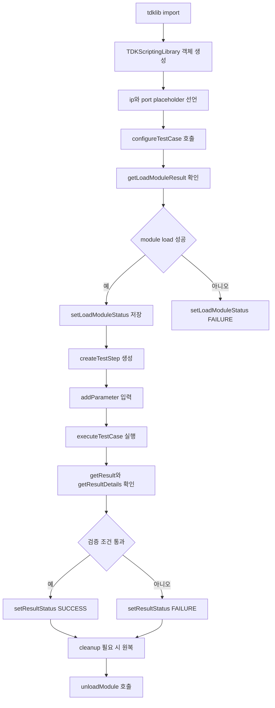
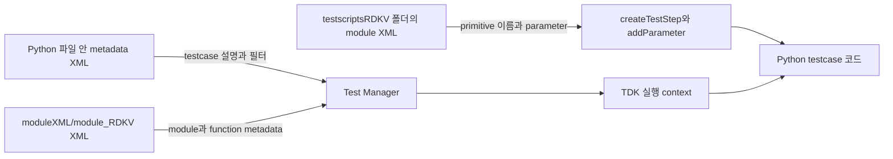
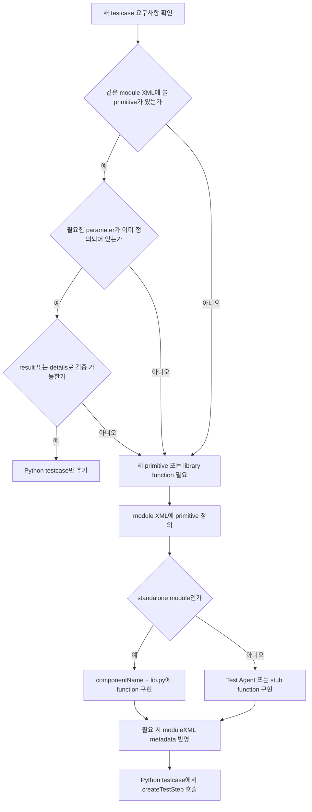
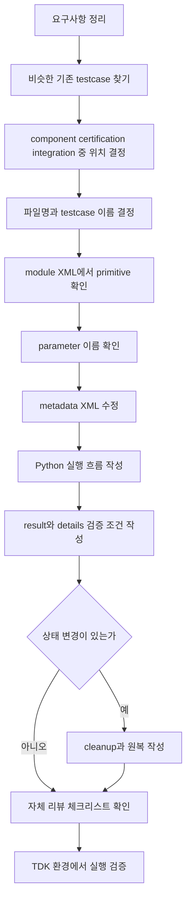
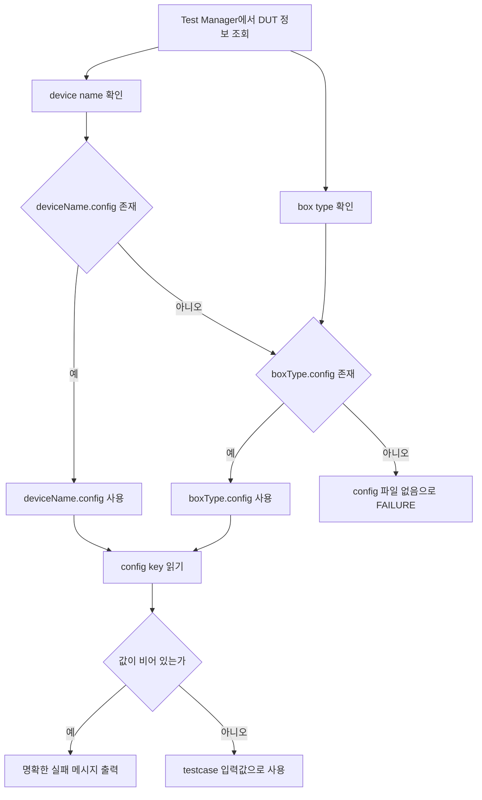
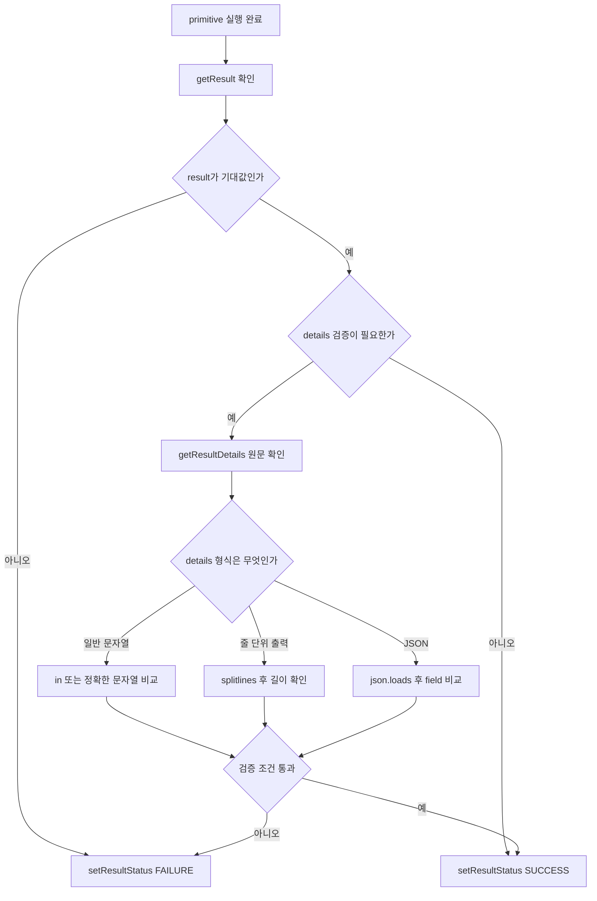
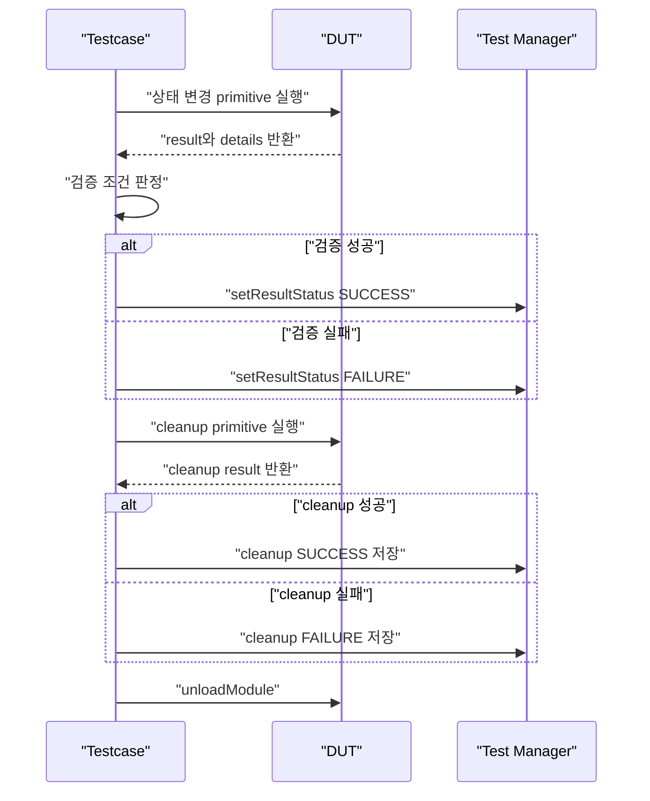

# testscriptsRDKV Testcase 작성 학습 가이드

이 문서는 `framework/fileStore/testscriptsRDKV` 아래의 RDKV TDK testcase를 처음 작성하는 사람이 이 파일 하나만 보고 기본 testcase를 만들 수 있도록 설명한다. Python 문법 기초부터 TDK wrapper 사용법, XML 매핑, 결과 판정, 신규 testcase 작성 순서까지 한 흐름으로 정리했다.

## 0. 먼저 알아야 할 전체 그림

TDK testcase는 단순히 Python 파일 하나만 작성하는 구조가 아니다. 보통 다음 요소가 함께 움직인다.

```text
framework/fileStore/testscriptsRDKV/
  certification/
    rdkv_security/
      RDKV_CERT_SVS_Check_ASLR_Enabled.py
      rdkv_security.xml
    rdkv_stability/
      RDKV_CERT_RVS_AppManager_LaunchApp_LifeCycle.py
      rdkv_stability.xml
  component/
    rdk_logger/
      RDKLogger_Log_Debug.py
      rdk_logger.xml
  integration/
    vulkan_cts/
      Vulkan_CTS_IMAGE.py
```

각 파일의 역할은 다음과 같다.

| 파일/디렉터리 | 역할 |
| --- | --- |
| `*.py` | 실제 testcase 실행 흐름을 작성하는 Python 스크립트 |
| 같은 폴더의 `*.xml` | primitive test 이름, 실제 stub function 이름, 파라미터 이름을 정의 |
| Python 파일 맨 위의 `''' ... XML ... '''` | Test Manager에 등록될 testcase 메타데이터 |
| `framework/fileStore/tdklib.py` | testcase Python 코드가 TDK/Test Manager와 통신할 때 쓰는 wrapper |
| `framework/fileStore/tdkStandAlonelib.py` | `standAlone=True`일 때 component library를 직접 import해서 primitive를 실행 |
| `moduleXML/module_RDKV/*.xml` | 모듈/primitive metadata를 관리하는 별도 XML. 환경에 따라 import/등록에 사용 |

TDK testcase의 핵심 흐름은 항상 비슷하다.

```text
1. tdklib import
2. TDKScriptingLibrary 객체 생성
3. ip, port placeholder 선언
4. configureTestCase() 호출
5. getLoadModuleResult()로 모듈 로드 결과 확인
6. createTestStep()으로 primitive test 생성
7. addParameter()로 primitive 파라미터 입력
8. executeTestCase() 실행
9. getResult(), getResultDetails()로 결과 읽기
10. setResultStatus("SUCCESS" 또는 "FAILURE")로 결과 저장
11. unloadModule()로 모듈 unload
```

같은 흐름을 그림으로 보면 아래와 같다.



## 1. Python 문법을 아주 작게 쪼개서 보기

RDKV testcase는 Python으로 작성된다. 복잡한 Python을 모두 알아야 하는 것은 아니지만, 아래 문법은 반드시 알아야 한다.

### 1.1 주석

`#` 뒤의 내용은 실행되지 않는다.

```python
# 이 줄은 설명이다. Python이 실행하지 않는다.
print("Hello")
```

여러 줄 설명은 문자열처럼 `''' ... '''`를 쓰는 경우가 많다. 이 repo에서는 testcase metadata XML을 Python 파일 맨 위에 아래처럼 넣는다.

```python
'''
<?xml version="1.0" encoding="UTF-8"?>
<xml>
  <name>My_Testcase</name>
</xml>
'''
```

이 XML 문자열은 Python 실행 중 직접 쓰이지 않더라도 Test Manager로 export/import할 때 testcase 설명으로 사용된다.

### 1.2 import

다른 Python 파일이나 라이브러리의 기능을 가져올 때 `import`를 사용한다.

```python
import tdklib
import time
```

이렇게 쓰면 `tdklib.TDKScriptingLibrary`처럼 `tdklib.`을 붙여 사용한다.

```python
obj = tdklib.TDKScriptingLibrary("rdkv_security", "1", standAlone=True)
```

다른 형태도 있다.

```python
from tdklib import TDKScriptingLibrary

obj = TDKScriptingLibrary("rdklogger", "2.0")
```

`from ... import ...`를 쓰면 `tdklib.`을 붙이지 않고 바로 이름을 쓸 수 있다.

### 1.3 변수

변수는 값을 담는 이름이다.

```python
expectedResult = "SUCCESS"
module = "TEST"
level = "DEBUG"
test_count = 5
```

문자열은 따옴표로 감싼다.

```python
app_name = "com.rdkcentral.google"
```

숫자는 따옴표 없이 쓴다.

```python
continue_count = 0
```

TDK에서 결과값은 대부분 `"SUCCESS"` 또는 `"FAILURE"` 문자열로 비교한다.

### 1.4 세미콜론

기존 testcase에는 C 스타일처럼 줄 끝에 `;`가 붙은 코드가 많다.

```python
import tdklib;
tdkTestObj.setResultStatus("SUCCESS");
```

Python에서는 보통 세미콜론이 필요 없다. 아래처럼 쓰는 것이 더 자연스럽다.

```python
import tdklib
tdkTestObj.setResultStatus("SUCCESS")
```

기존 스타일을 맞추기 위해 세미콜론을 유지해도 동작은 하지만, 새로 작성할 때는 세미콜론 없이 쓰는 편이 읽기 쉽다.

### 1.5 들여쓰기

Python은 `{}` 대신 들여쓰기로 코드 블록을 구분한다.

```python
if result == "SUCCESS":
    print("pass")
    tdkTestObj.setResultStatus("SUCCESS")
else:
    print("fail")
    tdkTestObj.setResultStatus("FAILURE")
```

`if` 아래에 실행할 코드는 반드시 들여쓰기해야 한다. 보통 공백 4칸을 쓴다.

잘못된 예:

```python
if result == "SUCCESS":
print("pass")
```

위 코드는 `print()`가 들여쓰기되지 않아 문법 에러가 난다.

### 1.6 if 조건문

조건이 맞을 때만 실행하려면 `if`를 쓴다.

```python
if "SUCCESS" in result.upper():
    print("Module loaded")
else:
    print("Module load failed")
```

여기서 중요한 문법은 세 가지다.

| 코드 | 의미 |
| --- | --- |
| `result.upper()` | 문자열을 대문자로 변환 |
| `"SUCCESS" in result.upper()` | 대문자로 바꾼 문자열 안에 `SUCCESS`가 들어 있는지 확인 |
| `:` | 이 조건 아래에 블록이 시작됨 |

기존 코드에는 아래처럼 쓰는 경우가 많다.

```python
if expectedResult in result.upper():
```

`expectedResult`가 `"SUCCESS"`이면, 결과 문자열에 `SUCCESS`가 포함되어 있는지 보는 코드다.

### 1.7 `==`와 `is`

값이 같은지 비교할 때는 `==`를 사용한다.

```python
if aslrValue == 2:
    print("ASLR enabled")
```

기존 일부 코드에는 `if aslrValue is 2:` 같은 표현이 있다. Python에서 `is`는 값 비교가 아니라 "같은 객체인가"를 보는 연산자다. 숫자나 문자열 값을 비교할 때는 `==`를 써야 한다.

### 1.8 리스트

리스트는 여러 값을 순서대로 담는다.

```python
configKeyList = ["SSH_METHOD", "SSH_USERNAME", "SSH_PASSWORD"]
```

반복문으로 하나씩 꺼낼 수 있다.

```python
for configKey in configKeyList:
    print(configKey)
```

### 1.9 딕셔너리

딕셔너리는 key와 value를 묶어서 저장한다.

```python
configValues = {}
configValues["SSH_METHOD"] = "directSSH"
configValues["SSH_USERNAME"] = "root"
```

읽을 때는 key를 대괄호 안에 넣는다.

```python
ssh_method = configValues["SSH_METHOD"]
```

이 repo에서는 plugin 상태를 저장할 때도 딕셔너리를 사용한다.

```python
plugin_status_needed = {
    "org.rdk.DownloadManager": "activated",
    "org.rdk.PackageManagerRDKEMS": "activated",
    "org.rdk.AppManager": "activated"
}
```

### 1.10 for 반복문

같은 작업을 여러 번 반복할 때 쓴다.

```python
for i in range(test_count):
    print("ITERATION:", i + 1)
```

`range(5)`는 `0, 1, 2, 3, 4`를 만든다. 그래서 사람이 보는 반복 번호는 보통 `i + 1`로 출력한다.

### 1.11 while 반복문

조건이 참인 동안 계속 반복한다.

```python
continue_count = 0
while True:
    if continue_count > 120:
        break
    time.sleep(1)
    continue_count += 1
```

`while True`는 무한 반복이다. 반드시 `break`로 빠져나올 조건이 있어야 한다.

### 1.12 문자열 다루기

TDK 결과 상세값은 문자열로 오는 경우가 많다. 그래서 `split`, `replace`, `strip` 같은 문자열 함수가 자주 쓰인다.

```python
output = tdkTestObj.getResultDetails()
output = output.splitlines()
aslrValue = int(output[1])
```

| 함수 | 의미 |
| --- | --- |
| `splitlines()` | 여러 줄 문자열을 줄 단위 리스트로 나눔 |
| `split(",")` | 쉼표 기준으로 문자열을 나눔 |
| `replace("old", "new")` | 문자열 일부를 교체 |
| `strip()` | 앞뒤 공백/개행 제거 |
| `int("2")` | 문자열 `"2"`를 숫자 `2`로 변환 |

### 1.13 print

실행 로그를 남길 때 `print()`를 쓴다.

```python
print("[LIB LOAD STATUS]  :  %s" % result)
print("Requested module: %s" % module)
print(f"Launching {app_name}")
```

문자열 안에 값을 넣는 방식은 여러 가지가 있다.

```python
print("Result: %s" % result)
print("Result: {}".format(result))
print(f"Result: {result}")
```

기존 testcase는 `%s` 스타일이 많다. 새 코드에서는 f-string을 써도 된다.

### 1.14 함수

반복되는 코드를 함수로 만들 수 있다.

```python
def mark_result(tdkTestObj, result):
    if "SUCCESS" in result.upper():
        tdkTestObj.setResultStatus("SUCCESS")
    else:
        tdkTestObj.setResultStatus("FAILURE")
```

하지만 기존 testcase는 대부분 파일 위에서 아래로 직접 실행되는 script style이다. 새 testcase를 처음 만들 때는 함수보다 기존 style을 따라가는 편이 쉽다.

### 1.15 예외 처리

오류가 날 수 있는 코드는 `try/except`로 감쌀 수 있다.

```python
try:
    aslrValue = int(output[1])
except Exception as e:
    print("FAILURE: Unable to parse ASLR value")
    tdkTestObj.setResultStatus("FAILURE")
```

기본 testcase에서는 모든 곳에 `try/except`를 넣기보다, 실패 가능성이 높은 parsing이나 config 읽기 부분에 넣는 것이 좋다.

## 2. TDK testcase의 핵심 객체

### 2.1 `TDKScriptingLibrary`

대부분의 testcase는 먼저 `TDKScriptingLibrary` 객체를 만든다.

```python
import tdklib

obj = tdklib.TDKScriptingLibrary("rdkv_security", "1", standAlone=True)
```

인자의 의미는 다음과 같다.

| 인자 | 예시 | 의미 |
| --- | --- | --- |
| component name | `"rdkv_security"` | 로드할 TDK component/module 이름 |
| version | `"1"` 또는 `"2.0"` | primitive/module version |
| `standAlone=True` | `True` 또는 생략 | Python library를 직접 import해서 실행하는 standalone 방식 |

`component name`은 같은 폴더의 XML에 있는 `<module name="...">` 값과 맞아야 한다.

예: `framework/fileStore/testscriptsRDKV/certification/rdkv_security/rdkv_security.xml`

```xml
<module name="rdkv_security" testGroup="Component">
```

그러면 Python도 아래처럼 쓴다.

```python
obj = tdklib.TDKScriptingLibrary("rdkv_security", "1", standAlone=True)
```

### 2.2 `ip = <ipaddress>`, `port = <port>`

기존 testcase에는 아래 코드가 거의 항상 있다.

```python
ip = <ipaddress>
port = <port>
```

이것은 일반 Python 문법으로 보면 완성된 값이 아니다. Test Manager가 실행할 때 실제 DUT IP와 port로 치환하는 placeholder다. 직접 로컬에서 이 파일을 `python script.py`로 실행하면 이 부분 때문에 문법 오류가 날 수 있다.

TDK 환경에서 실행할 testcase에는 이 placeholder를 그대로 둔다.

### 2.3 `configureTestCase()`

기존 testcase에서는 아래처럼 호출한다.

```python
obj.configureTestCase(ip, port, "RDKV_CERT_SVS_Check_ASLR_Enabled")
```

실제 `tdklib.py`의 full signature는 Test Manager가 더 많은 인자를 주입하는 구조지만, testcase template에서는 보통 `ip`, `port`, `script name` 세 값을 넣는다.

세 번째 인자는 testcase script 이름이다. 보통 Python 파일명에서 `.py`를 뺀 값과 같아야 한다.

```text
파일명: RDKV_CERT_SVS_Check_ASLR_Enabled.py
script name: RDKV_CERT_SVS_Check_ASLR_Enabled
```

### 2.4 `getLoadModuleResult()`

component/module이 로드됐는지 확인한다.

```python
result = obj.getLoadModuleResult()
print("[LIB LOAD STATUS]  :  %s" % result)
```

성공하면 보통 `"Success"` 또는 `"SUCCESS"` 계열 문자열이 온다. 그래서 비교할 때는 대문자로 바꾼다.

```python
if "SUCCESS" in result.upper():
    print("module loaded")
```

### 2.5 `setLoadModuleStatus()`

모듈 로드 결과를 Test Manager 결과로 저장한다.

```python
obj.setLoadModuleStatus(result)
```

로드에 실패했으면 아래처럼 명시적으로 실패 저장한다.

```python
obj.setLoadModuleStatus("FAILURE")
```

### 2.6 `createTestStep()`

primitive test 하나를 실행하기 위한 객체를 만든다.

```python
tdkTestObj = obj.createTestStep("rdkvsecurity_executeInDUT")
```

이 이름은 같은 폴더의 XML에 있는 `<primitiveTest name="...">`와 맞아야 한다.

```xml
<primitiveTest name="rdkvsecurity_executeInDUT" id=" " version="1">
  <function>rdkvsecurity_executeInDUT</function>
  <parameters>
    <parameter name="command" value=""/>
    <parameter name="credentials" value=""/>
    <parameter name="sshMethod" value=""/>
  </parameters>
</primitiveTest>
```

여기서 `name`은 Python에서 `createTestStep()`에 넣는 이름이다.

### 2.7 `addParameter()`

primitive test에 필요한 파라미터 값을 넣는다.

```python
tdkTestObj.addParameter("sshMethod", "directSSH")
tdkTestObj.addParameter("credentials", credentials)
tdkTestObj.addParameter("command", "cat /proc/sys/kernel/randomize_va_space")
```

가장 중요한 규칙은 파라미터 이름이 XML과 정확히 같아야 한다는 점이다.

XML:

```xml
<parameter name="sshMethod" value=""/>
<parameter name="credentials" value=""/>
<parameter name="command" value=""/>
```

Python:

```python
tdkTestObj.addParameter("sshMethod", configValues["SSH_METHOD"])
tdkTestObj.addParameter("credentials", credentials)
tdkTestObj.addParameter("command", command)
```

`tdklib.py`의 `addParameter()`는 JSON 내부에서 같은 이름의 key를 찾아 값을 바꾼다. 이름이 틀리면 `"Parameter (...) not found in primitive test"` 에러가 나고 종료된다.

잘못된 예:

```python
tdkTestObj.addParameter("ssh_method", "directSSH")
```

XML에는 `sshMethod`가 있는데 Python에서 `ssh_method`라고 쓰면 실패한다.

### 2.8 `executeTestCase()`

primitive test를 실제로 실행한다.

```python
expectedResult = "SUCCESS"
tdkTestObj.executeTestCase(expectedResult)
```

`expectedResult`는 이 primitive가 기대하는 결과다. 대부분 positive testcase는 `"SUCCESS"`를 기대한다.

### 2.9 `getResult()`

primitive 실행 결과의 pass/fail 문자열을 읽는다.

```python
result = tdkTestObj.getResult()
print("[TEST EXECUTION RESULT] : %s" % result)
```

보통 `"SUCCESS"` 또는 `"FAILURE"`가 온다.

### 2.10 `getResultDetails()`

primitive 실행의 상세 메시지를 읽는다.

```python
details = tdkTestObj.getResultDetails()
print("Details: %s" % details)
```

상세값은 단순 성공 메시지일 수도 있고, DUT 명령 출력일 수도 있고, JSON 문자열일 수도 있다. testcase의 실제 검증은 `details`를 파싱해서 하는 경우가 많다.

### 2.11 `setResultStatus()`

Test Manager에 이 test step의 최종 결과를 저장한다.

```python
tdkTestObj.setResultStatus("SUCCESS")
```

검증 실패 시:

```python
tdkTestObj.setResultStatus("FAILURE")
```

중요한 점은 `getResult()`가 `"SUCCESS"`여도 testcase의 최종 검증이 실패할 수 있다는 것이다. 예를 들어 DUT 명령 실행 자체는 성공했지만 출력값이 기대와 다르면 `setResultStatus("FAILURE")`를 해야 한다.

```python
result = tdkTestObj.getResult()
details = tdkTestObj.getResultDetails()

if "SUCCESS" in result.upper() and "expected text" in details:
    tdkTestObj.setResultStatus("SUCCESS")
else:
    tdkTestObj.setResultStatus("FAILURE")
```

### 2.12 `unloadModule()`

테스트가 끝나면 module을 unload한다.

```python
obj.unloadModule("rdkv_security")
```

인자는 처음 `TDKScriptingLibrary()`에 넣은 component name과 맞추는 것이 원칙이다.

```python
obj = tdklib.TDKScriptingLibrary("rdkv_security", "1", standAlone=True)
...
obj.unloadModule("rdkv_security")
```

### 2.13 `standAlone=True`가 헷갈리는 이유

기존 코드에는 아래 두 방식이 섞여 있다.

```python
obj = tdklib.TDKScriptingLibrary("rdkv_security", "1", standAlone=True)
```

```python
obj = TDKScriptingLibrary("rdklogger", "2.0")
```

`standAlone=True`는 primitive 실행 방식에 영향을 준다.

| 방식 | 코드 예 | 동작 감각 |
| --- | --- | --- |
| standalone | `TDKScriptingLibrary("rdkv_security", "1", standAlone=True)` | `tdkStandAlonelib.py`가 `rdkv_securitylib`처럼 component name 뒤에 `lib`를 붙인 Python module을 import하고, 그 안의 function을 직접 호출한다. |
| agent/socket 방식 | `TDKScriptingLibrary("rdklogger", "2.0")` | Test Agent에 socket으로 JSON-RPC 요청을 보내고, agent 쪽 stub/shared object가 primitive function을 실행한다. |

`standAlone=True`라고 해서 Test Manager와 완전히 무관해지는 것은 아니다. `tdklib.py`는 여전히 Test Manager REST API에서 primitive JSON을 가져오고, result 저장 API를 호출한다. 즉 standalone은 "primitive를 어디서 실행하느냐"의 차이에 가깝다.

초보자가 판단하는 기준은 다음과 같다.

1. 같은 module의 기존 testcase가 `standAlone=True`를 쓰면 새 testcase도 일단 그대로 따른다.
2. 같은 module의 기존 testcase가 `standAlone=True`를 쓰지 않으면 새 testcase도 빼고 작성한다.
3. primitive가 Python library로 구현되어 있고 `componentName + "lib"` 형태로 import되는 구조라면 standalone일 가능성이 높다.
4. C/C++ stub agent, shared object, Test Agent RPC를 호출하는 오래된 component testcase는 standalone이 아닐 가능성이 높다.

예를 들어 `rdkv_security`는 기존 security testcase가 아래처럼 작성되어 있다.

```python
obj = tdklib.TDKScriptingLibrary("rdkv_security", "1", standAlone=True)
```

따라서 새 security testcase도 먼저 이 방식을 따른다.

### 2.14 `executeTestCaseReboot()`

일반 primitive는 아래처럼 실행한다.

```python
tdkTestObj.executeTestCase(expectedResult)
```

하지만 primitive 자체가 DUT reboot를 일으키는 경우에는 `executeTestCaseReboot()`를 쓰는 testcase가 있다.

```python
tdkTestObj.executeTestCaseReboot(expectedResult)
```

이 함수는 reboot 요청을 보낸 뒤 일반 응답 수신 흐름을 오래 기다리지 않고 `"Request Sent"` 형태의 성공 결과를 만든다. 전원, reboot, reset처럼 agent 연결이 끊길 수 있는 primitive에만 사용한다.

처음 testcase를 작성할 때는 기존 module 안에서 같은 종류의 reboot testcase를 찾아 그대로 따르는 것이 안전하다. reboot가 아닌 일반 검증에는 `executeTestCase()`를 사용한다.

### 2.15 `setAsNotApplicable()`

장치 기능이나 stream 조건이 맞지 않아 testcase를 실패로 볼 수 없는 경우가 있다. 이때 일부 media testcase는 아래 API를 사용한다.

```python
obj.setAsNotApplicable()
```

의미는 "테스트 자체가 해당 장치/조건에 적용되지 않는다"이다. 실패(`FAILURE`)와 다르다.

사용하면 좋은 경우:

1. DUT가 해당 codec, DRM, resolution, app capability를 지원하지 않는 것이 정상인 경우
2. testcase precondition이 장치 profile상 성립하지 않는 경우
3. 실행하면 의미 없는 실패만 발생하는 경우

사용하면 안 되는 경우:

1. primitive 실행이 실패했는데 원인을 모르겠는 경우
2. parameter 이름을 틀렸거나 config가 빠진 경우
3. 테스트 로직이 잘못되어 기대 결과를 얻지 못한 경우

그런 경우는 `FAILURE`로 처리해야 한다.

### 2.16 `logPerformanceData()`

성능 측정 testcase에서는 primitive 결과 외에 측정값을 별도로 기록해야 할 수 있다. 기존 iarmbus 반복 테스트에는 아래 패턴이 있다.

```python
perfData = tdkTestObj.logPerformanceData(
    "IRKeyEventPropagation_AveragedTime",
    "ms",
    str(dv.getMean()),
    "keytype:" + str(keytype) + " keycode:" + str(keycode)
)
```

인자의 의미는 다음과 같다.

| 인자 | 예시 | 의미 |
| --- | --- | --- |
| performanceDataName | `"IRKeyEventPropagation_AveragedTime"` | 성능 지표 이름 |
| performanceDataUnit | `"ms"` | 단위 |
| performanceDataReading | `"123.4"` | 측정값 |
| performanceDataInfo | `"keytype:... keycode:..."` | 부가 설명 |

일반 functional testcase에서는 거의 필요 없다. performance/profiling 성격의 testcase에서만 고려한다.

### 2.17 `Create_ExecuteTestcase()` helper

일부 오래된 testcase는 아래 helper를 쓴다.

```python
actualresult, tdkTestObj, details = tdklib.Create_ExecuteTestcase(
    obj,
    "Tr069_Get_Profile_Parameter_Values",
    "SUCCESS",
    verifyList={},
    path=profilePath
)
```

이 helper는 내부에서 다음 작업을 한 번에 한다.

```text
createTestStep()
addParameter()
executeTestCase()
getResult()
getResultDetails()
setResultStatus()
```

장점은 코드가 짧아지는 것이다. 단점은 초보자가 실패 조건과 result 저장 흐름을 놓치기 쉽다는 점이다. 새 testcase를 처음 작성할 때는 helper보다 명시적으로 `createTestStep()`부터 `setResultStatus()`까지 직접 쓰는 것을 추천한다.

## 3. XML을 읽는 방법

RDKV testcase 작성에서 XML은 두 종류를 봐야 한다.

### 3.1 Python 파일 안의 testcase metadata XML

예: `RDKV_CERT_SVS_Check_ASLR_Enabled.py`

```xml
<name>RDKV_CERT_SVS_Check_ASLR_Enabled</name>
<primitive_test_name>rdkvsecurity_executeInDUT</primitive_test_name>
<test_case_id>RDKV_SECURITY_26</test_case_id>
<test_objective>Check whether ASLR is enabled or not</test_objective>
<automation_approch>...</automation_approch>
<expected_output>If the value is 2, it is PASS else FAIL</expected_output>
<test_script>RDKV_CERT_SVS_Check_ASLR_Enabled</test_script>
```

작성할 때 확인할 필드는 다음과 같다.

| 필드 | 작성법 |
| --- | --- |
| `<name>` | Python 파일명에서 `.py`를 뺀 이름 |
| `<primitive_test_name>` | 주로 사용하는 대표 primitive 이름 |
| `<test_case_id>` | 프로젝트 규칙에 맞는 testcase ID |
| `<test_objective>` | 무엇을 검증하는지 한 문장 |
| `<pre_requisite>` | 사전 조건. 없으면 `None` |
| `<input_parameters>` | 테스트 입력값 |
| `<automation_approch>` | 자동화 절차. 기존 오타 `approch`를 유지 |
| `<expected_output>` 또는 `<except_output>` | 기대 결과. 기존 파일마다 태그명이 다를 수 있음 |
| `<test_script>` | Python script name |
| `<skip>` | 실행 제외 여부. 보통 `false` |

새 testcase를 만들 때는 같은 module 안의 비슷한 Python 파일을 복사해서 metadata를 바꾸는 방식이 가장 안전하다.

### 3.2 같은 폴더의 primitive XML

예: `rdkv_security.xml`

```xml
<module name="rdkv_security" testGroup="Component">
  <primitiveTests>
    <primitiveTest name="rdkvsecurity_executeInDUT" id=" " version="1">
      <function>rdkvsecurity_executeInDUT</function>
      <parameters>
        <parameter name="command" value=""/>
        <parameter name="credentials" value=""/>
        <parameter name="sshMethod" value=""/>
      </parameters>
    </primitiveTest>
  </primitiveTests>
</module>
```

읽는 순서는 다음과 같다.

1. `<module name="rdkv_security">`를 확인한다.
2. Python에서 `TDKScriptingLibrary("rdkv_security", "1", ...)`로 같은 이름을 쓴다.
3. 사용할 `<primitiveTest name="...">`를 찾는다.
4. Python에서 `obj.createTestStep("...")`에 같은 이름을 넣는다.
5. `<parameter name="...">` 목록을 본다.
6. Python에서 `tdkTestObj.addParameter("...", value)`로 같은 이름을 넣는다.

### 3.3 `moduleXML/module_RDKV/*.xml`

`moduleXML/module_RDKV` 아래 XML은 module, function, primitive metadata를 더 큰 단위로 관리한다. 예를 들어 `moduleXML/module_RDKV/rdkv_stability.xml`에는 module name, category, primitive function, parameter type 등이 들어 있다.

기존 module에 있는 primitive만 조합해서 testcase를 만들 때는 보통 `testscriptsRDKV/.../<module>.xml`과 Python 파일을 보면 된다. 완전히 새로운 primitive/function을 추가해야 한다면 `moduleXML` 쪽 metadata까지 맞춰야 할 수 있다.

### 3.4 세 종류 XML의 차이

초보자가 가장 헷갈리는 부분은 "XML이 여러 군데 있는데 무엇을 고쳐야 하느냐"이다.

| 위치 | 예시 | 주 역할 | 새 testcase 작성 시 |
| --- | --- | --- | --- |
| Python 파일 안의 XML 문자열 | `RDKV_CERT_SVS_Check_ASLR_Enabled.py` 맨 위 | testcase 설명, testcase ID, 목적, box type, skip 여부 | 거의 항상 수정 |
| testcase 폴더의 module XML | `testscriptsRDKV/certification/rdkv_security/rdkv_security.xml` | primitive 이름, stub function 이름, parameter 목록 | 기존 primitive를 쓰면 읽기만 함. 새 primitive면 수정 가능 |
| `moduleXML/module_RDKV/*.xml` | `moduleXML/module_RDKV/rdkv_stability.xml` | Test Manager가 module/function/primitive metadata를 관리할 때 쓰는 상위 metadata | 새 primitive/function 등록이 필요할 때 확인 |



대부분의 신규 testcase는 "이미 존재하는 primitive를 새 순서와 새 검증 조건으로 조합"한다. 이 경우는 Python 파일만 새로 만들고, 같은 폴더의 module XML은 이름과 parameter 확인용으로 읽는다.

반대로 "장치에서 실행할 새로운 기능 함수가 아직 없다"면 primitive 자체를 추가해야 한다. 그때는 Python testcase만 작성해서는 안 된다.

### 3.5 새 testcase만 추가하는 경우

다음 조건이면 새 testcase만 추가하면 된다.

1. 같은 module XML에 사용할 `<primitiveTest name="...">`가 이미 있다.
2. 필요한 입력값이 XML의 `<parameter>`로 이미 정의되어 있다.
3. primitive function이 반환하는 `result/details`만으로 새 검증을 만들 수 있다.

예를 들어 `rdkv_security.xml`에 이미 아래 primitive가 있다.

```xml
<primitiveTest name="rdkvsecurity_executeInDUT" id=" " version="1">
  <function>rdkvsecurity_executeInDUT</function>
  <parameters>
    <parameter name="command" value=""/>
    <parameter name="credentials" value=""/>
    <parameter name="sshMethod" value=""/>
  </parameters>
</primitiveTest>
```

DUT에서 다른 command를 실행하고 출력만 다르게 검증한다면 새 primitive가 필요 없다. Python testcase에서 `command` 값만 바꾸면 된다.

```python
command = "cat /some/file"
tdkTestObj = obj.createTestStep("rdkvsecurity_executeInDUT")
tdkTestObj.addParameter("sshMethod", configValues["SSH_METHOD"])
tdkTestObj.addParameter("credentials", credentials)
tdkTestObj.addParameter("command", command)
```

### 3.6 새 primitive까지 필요한 경우

다음 조건이면 Python testcase만 추가해서는 부족할 수 있다.

1. 기존 primitive로는 필요한 DUT/TM 동작을 실행할 수 없다.
2. 기존 primitive parameter 목록에 필요한 입력이 없다.
3. `details` parsing만으로는 검증할 수 없고, agent/lib 쪽에 새로운 function이 필요하다.
4. Test Manager에서 primitive 자체를 새 항목으로 선택/관리해야 한다.

이 경우 필요한 작업은 보통 다음 흐름이다.

```text
1. module XML에 새 <primitiveTest> 추가
2. primitive가 호출할 <function> 이름 결정
3. 필요한 <parameter name="..."> 정의
4. standalone module이면 <componentName>lib.py에 같은 이름의 Python function 구현
5. agent 방식 module이면 해당 Test Agent/stub 쪽 function 구현
6. 필요 시 moduleXML/module_RDKV/*.xml metadata 반영
7. Python testcase에서 createTestStep()으로 새 primitive 호출
```

이 문서는 주로 testcase 작성 가이드이므로 agent/stub 구현까지 깊게 다루지는 않는다. 하지만 새 primitive가 필요한 상황인지 아닌지는 반드시 먼저 판단해야 한다.

판단 흐름은 아래처럼 잡으면 된다.



### 3.7 `<function>`과 `<primitiveTest name>`의 차이

module XML에는 이름이 두 개 나온다.

```xml
<primitiveTest name="RDKLogger_Log_Msg" id="591" version="1">
  <function>TestMgr_RDKLogger_Log_Msg</function>
</primitiveTest>
```

Python testcase에서 쓰는 이름은 `<primitiveTest name="...">`이다.

```python
tdkTestObj = obj.createTestStep("RDKLogger_Log_Msg")
```

`<function>`은 실제 agent/lib 쪽에서 호출될 function 이름이다. Python testcase에서 보통 직접 쓰지 않는다.

정리하면 다음과 같다.

| XML 필드 | 누가 사용하나 | 예시 |
| --- | --- | --- |
| `<primitiveTest name>` | Python testcase의 `createTestStep()` | `RDKLogger_Log_Msg` |
| `<function>` | Test Agent 또는 standalone lib 실행부 | `TestMgr_RDKLogger_Log_Msg` |
| `<parameter name>` | Python testcase의 `addParameter()` | `level`, `module`, `msg` |

### 3.8 metadata XML에서 자주 헷갈리는 필드

Python 파일 맨 위 metadata XML에는 실행에 직접 관여하지 않아 보이는 필드가 많다. 그래도 Test Manager 표시, 필터링, import/export에 영향을 줄 수 있으므로 의미를 알고 작성해야 한다.

| 필드 | 의미 | 작성 팁 |
| --- | --- | --- |
| `<id>` | Test Manager 내부 testcase ID | 새 testcase면 비워두는 기존 패턴이 많다. |
| `<version>` | testcase metadata version | 새 testcase는 보통 `1`에서 시작한다. |
| `<name>` | testcase 이름 | 파일명과 맞춘다. |
| `<primitive_test_name>` | 대표 primitive 이름 | testcase가 여러 primitive를 써도 핵심 primitive를 적는 경우가 많다. |
| `<execution_time>` | 예상 실행 시간/timeout 기준 | 짧은 functional test는 5 같은 값, long/stress test는 더 크게 잡는다. |
| `<long_duration>` | 장시간 테스트 여부 | stress, 24시간 테스트면 `true` 가능. |
| `<advanced_script>` | advanced script 여부 | 기존 유사 testcase 값을 따른다. |
| `<skip>` | Test Manager에서 skip할지 여부 | 기본은 `false`. 임시로 제외할 때만 `true`. |
| `<box_types>` | 대상 장치 type | 기존 유사 testcase와 대상 DUT 지원 범위를 맞춘다. |
| `<rdk_versions>` | 대상 RDK version | 기존 module 패턴을 따른다. |
| `<priority>` | 중요도 | certification/security 핵심 검증은 `High`가 많다. |
| `<script_tags>` | 분류 태그 | 예: `BASIC`. 없으면 빈 태그 유지 가능. |

`<expected_output>`과 `<except_output>`은 기존 파일마다 둘 다 보인다. 새 파일은 같은 module의 최근 파일이 쓰는 태그명을 따라가는 것이 안전하다. 이미 쓰던 typo인 `<automation_approch>`도 기존 schema 호환을 위해 그대로 두는 편이 낫다.

## 4. 가장 작은 testcase 뼈대

아래는 새 testcase를 만들 때 출발점으로 쓸 수 있는 기본 뼈대다.

```python
##########################################################################
# Copyright ...
##########################################################################
'''
<?xml version="1.0" encoding="UTF-8"?>
<xml>
  <id></id>
  <version>1</version>
  <name>MY_NEW_TESTCASE</name>
  <primitive_test_id></primitive_test_id>
  <primitive_test_name>primitive_name_here</primitive_test_name>
  <primitive_test_version>1</primitive_test_version>
  <status>FREE</status>
  <synopsis>Short testcase summary</synopsis>
  <groups_id/>
  <execution_time>5</execution_time>
  <long_duration>false</long_duration>
  <advanced_script>false</advanced_script>
  <remarks></remarks>
  <skip>false</skip>
  <box_types>
    <box_type>Video_Accelerator</box_type>
  </box_types>
  <rdk_versions>
    <rdk_version>RDK2.0</rdk_version>
  </rdk_versions>
  <test_cases>
    <test_case_id>MY_MODULE_001</test_case_id>
    <test_objective>Describe what this testcase validates.</test_objective>
    <test_type>Positive</test_type>
    <test_setup>Describe target setup.</test_setup>
    <pre_requisite>None</pre_requisite>
    <api_or_interface_used>None</api_or_interface_used>
    <input_parameters>None</input_parameters>
    <automation_approch>1. Load module.
2. Execute primitive.
3. Validate response.
4. Mark pass or fail.</automation_approch>
    <expected_output>Expected condition should be satisfied.</expected_output>
    <priority>Medium</priority>
    <test_stub_interface>module_or_stub_name</test_stub_interface>
    <test_script>MY_NEW_TESTCASE</test_script>
    <skipped>No</skipped>
    <release_version></release_version>
    <remarks>None</remarks>
  </test_cases>
  <script_tags/>
</xml>
'''

import tdklib

obj = tdklib.TDKScriptingLibrary("module_name_here", "1", standAlone=True)

ip = <ipaddress>
port = <port>
obj.configureTestCase(ip, port, "MY_NEW_TESTCASE")

result = obj.getLoadModuleResult()
print("[LIB LOAD STATUS]  :  %s" % result)
obj.setLoadModuleStatus(result)

expectedResult = "SUCCESS"

if expectedResult in result.upper():
    tdkTestObj = obj.createTestStep("primitive_name_here")

    # XML에 parameter가 있으면 addParameter()로 값을 넣는다.
    # tdkTestObj.addParameter("parameter_name", "parameter_value")

    tdkTestObj.executeTestCase(expectedResult)
    result = tdkTestObj.getResult()
    details = tdkTestObj.getResultDetails()

    print("[TEST EXECUTION RESULT] : %s" % result)
    print("[TEST EXECUTION DETAILS] : %s" % details)

    if expectedResult in result.upper():
        tdkTestObj.setResultStatus("SUCCESS")
    else:
        tdkTestObj.setResultStatus("FAILURE")

    obj.unloadModule("module_name_here")
else:
    obj.setLoadModuleStatus("FAILURE")
    print("FAILURE: Failed to load module")
```

주의할 점:

1. `MY_NEW_TESTCASE`는 파일명과 같게 한다.
2. `"module_name_here"`는 XML의 `<module name="...">`와 같게 한다.
3. `"primitive_name_here"`는 XML의 `<primitiveTest name="...">`와 같게 한다.
4. `addParameter()` 이름은 XML의 `<parameter name="...">`와 철자, 대소문자까지 같게 한다.
5. 테스트가 끝나면 `unloadModule()`을 호출한다.

## 5. 예제 1: RDK Logger testcase 읽기

파일: `framework/fileStore/testscriptsRDKV/component/rdk_logger/RDKLogger_Log_Debug.py`

이 testcase의 목적은 DEBUG level log message를 남기는 것이다.

### 5.1 module 객체 생성

```python
from tdklib import TDKScriptingLibrary

obj = TDKScriptingLibrary("rdklogger", "2.0")
```

여기서는 `import tdklib`가 아니라 `from tdklib import TDKScriptingLibrary`를 사용했다. 그래서 `tdklib.TDKScriptingLibrary`가 아니라 `TDKScriptingLibrary`를 바로 호출한다.

### 5.2 primitive XML 확인

파일: `framework/fileStore/testscriptsRDKV/component/rdk_logger/rdk_logger.xml`

```xml
<primitiveTest name='RDKLogger_Log_Msg' id='591' version='1'>
  <function>TestMgr_RDKLogger_Log_Msg</function>
  <parameters>
    <parameter name='level' value='' />
    <parameter name='module' value='' />
    <parameter name='msg' value='' />
  </parameters>
</primitiveTest>
```

Python에서는 이 XML에 맞춰 아래처럼 작성한다.

```python
tdkTestObj = obj.createTestStep("RDKLogger_Log_Msg")
tdkTestObj.addParameter("module", "TEST")
tdkTestObj.addParameter("level", "DEBUG")
tdkTestObj.addParameter("msg", "Test Debug message")
```

### 5.3 실행과 결과 저장

```python
tdkTestObj.executeTestCase(expectedRes)
result = tdkTestObj.getResult()
details = tdkTestObj.getResultDetails()

if "SUCCESS" in result.upper():
    tdkTestObj.setResultStatus("SUCCESS")
else:
    tdkTestObj.setResultStatus("FAILURE")
```

이 testcase는 primitive 결과가 성공이면 그대로 성공 처리한다. 추가로 `details` 내용까지 검증하지는 않는다.

## 6. 예제 2: DUT 명령 실행 testcase 읽기

파일: `framework/fileStore/testscriptsRDKV/certification/rdkv_security/RDKV_CERT_SVS_Check_ASLR_Enabled.py`

이 testcase의 목적은 DUT의 `/proc/sys/kernel/randomize_va_space` 값을 읽고 ASLR이 enabled인지 확인하는 것이다.

### 6.1 device config 읽기

```python
configKeyList = ["SSH_METHOD", "SSH_USERNAME", "SSH_PASSWORD"]
configValues = {}
tdkTestObj = obj.createTestStep("rdkvsecurity_getDeviceConfig")

for configKey in configKeyList:
    tdkTestObj.addParameter("basePath", obj.realpath)
    tdkTestObj.addParameter("configKey", configKey)
    tdkTestObj.executeTestCase(expectedResult)
    configValues[configKey] = tdkTestObj.getResultDetails()
```

여기서는 `rdkvsecurity_getDeviceConfig` primitive를 사용해서 config 값을 하나씩 읽는다.

XML 정의는 다음과 같다.

```xml
<primitiveTest name="rdkvsecurity_getDeviceConfig" id=" " version="1">
  <function>rdkvsecurity_getDeviceConfig</function>
  <parameters>
    <parameter name="basePath" value=""/>
    <parameter name="configKey" value=""/>
  </parameters>
</primitiveTest>
```

그래서 Python의 `addParameter("basePath", ...)`, `addParameter("configKey", ...)`와 정확히 대응한다.

### 6.2 credentials 문자열 만들기

```python
credentials = obj.IP + "," + configValues["SSH_USERNAME"] + "," + configValues["SSH_PASSWORD"]
```

문자열끼리는 `+`로 이어 붙일 수 있다. 위 코드는 예를 들어 아래 같은 문자열을 만든다.

```text
192.168.0.10,root,password
```

password가 없는 경우 기존 코드는 `"None"`을 빈 문자열로 바꾼다.

```python
if configValues["SSH_PASSWORD"] == "None":
    configValues["SSH_PASSWORD"] = ""
```

### 6.3 DUT 명령 실행

```python
command = "cat /proc/sys/kernel/randomize_va_space"
tdkTestObj = obj.createTestStep("rdkvsecurity_executeInDUT")
tdkTestObj.addParameter("sshMethod", configValues["SSH_METHOD"])
tdkTestObj.addParameter("credentials", credentials)
tdkTestObj.addParameter("command", command)
tdkTestObj.executeTestCase(expectedResult)
```

XML 정의:

```xml
<primitiveTest name="rdkvsecurity_executeInDUT" id=" " version="1">
  <function>rdkvsecurity_executeInDUT</function>
  <parameters>
    <parameter name="command" value=""/>
    <parameter name="credentials" value=""/>
    <parameter name="sshMethod" value=""/>
  </parameters>
</primitiveTest>
```

### 6.4 출력 parsing

```python
output = tdkTestObj.getResultDetails()
output = output.splitlines()
aslrValue = int(output[1])
```

`getResultDetails()`가 여러 줄 문자열을 반환한다고 가정하고, `splitlines()`로 줄 단위 리스트를 만든다. 그 다음 두 번째 줄인 `output[1]`을 숫자로 바꾼다.

더 안전하게 작성한다면 아래처럼 검증을 추가하는 것이 좋다.

```python
output = tdkTestObj.getResultDetails()
lines = output.splitlines()

if len(lines) < 2:
    print("FAILURE: command output does not contain expected value")
    tdkTestObj.setResultStatus("FAILURE")
else:
    aslrValue = int(lines[1])
    if aslrValue == 2:
        print("SUCCESS: ASLR is enabled")
        tdkTestObj.setResultStatus("SUCCESS")
    else:
        print("FAILURE: ASLR is disabled")
        tdkTestObj.setResultStatus("FAILURE")
```

## 7. 예제 3: 여러 primitive를 순서대로 실행하는 testcase

파일: `framework/fileStore/testscriptsRDKV/integration/vulkan_cts/Vulkan_CTS_IMAGE.py`

이 testcase는 다음 순서로 실행된다.

```text
1. vulkan_cts module load
2. run_vulkan_cts_command 실행
3. copy_file 실행
4. copy_file 결과가 SUCCESS이면 report_generation 실행
5. 각 단계 결과에 따라 SUCCESS/FAILURE 저장
```

코드 흐름:

```python
tdkTestObj = obj.createTestStep("run_vulkan_cts_command")
tdkTestObj.addParameter("info_filename", info_filename)
tdkTestObj.executeTestCase(expectedresult)
details = tdkTestObj.getResultDetails()
```

그 다음 다른 primitive를 새로 만든다.

```python
tdkTestObj = obj.createTestStep("copy_file")
tdkTestObj.addParameter("qpa_folder_path", qpa_folder_path)
tdkTestObj.addParameter("qpa_file_name", qpa_file_name)
tdkTestObj.addParameter("result_dir", result_dir)
tdkTestObj.executeTestCase(expectedresult)
result = tdkTestObj.getResultDetails()
```

여기서 중요한 점은 primitive마다 새 `tdkTestObj`를 만든다는 것이다.

```python
tdkTestObj = obj.createTestStep("first_primitive")
...
tdkTestObj = obj.createTestStep("second_primitive")
...
tdkTestObj = obj.createTestStep("third_primitive")
```

각 primitive의 파라미터 목록은 XML에서 따로 확인해야 한다.

## 8. 예제 4: event를 기다리는 testcase

파일: `framework/fileStore/testscriptsRDKV/certification/rdkv_stability/RDKV_CERT_RVS_AppManager_LaunchApp_LifeCycle.py`

이 testcase는 단순히 primitive 하나만 실행하지 않는다. 앱을 설치하고, launch event listener를 등록하고, 여러 lifecycle event를 기다린다.

핵심 패턴:

```python
event_dict = {
    "APP_STATE_LOADING": False,
    "APP_STATE_INITIALIZING": False,
    "APP_STATE_PAUSED": False,
    "APP_STATE_ACTIVE": False
}
```

처음에는 모든 event를 `False`로 둔다. event를 받으면 해당 값을 `True`로 바꾼다.

```python
if '"APP_STATE_LOADING"' in event:
    event_dict["APP_STATE_LOADING"] = True
```

마지막에는 모든 값이 `True`인지 확인한다.

```python
if all(event_dict.values()):
    tdkTestObj.setResultStatus("SUCCESS")
else:
    tdkTestObj.setResultStatus("FAILURE")
```

`all()`은 리스트나 딕셔너리 값이 모두 참이면 `True`를 반환한다.

```python
all([True, True, True])   # True
all([True, False, True])  # False
```

event 대기 루프는 timeout이 반드시 있어야 한다.

```python
continue_count = 0
while True:
    if continue_count > 120:
        break
    if len(event_listener.getEventsBuffer()) == 0:
        time.sleep(1)
        continue_count += 1
        continue
```

`continue`는 이번 반복을 여기서 끝내고 다음 반복으로 넘어간다는 뜻이다.

## 9. 새 testcase 작성 순서

새 testcase를 만들 때는 아래 순서대로 진행한다.



### Step 1. 비슷한 testcase 찾기

먼저 새로 만들 테스트와 가장 비슷한 기존 파일을 찾는다.

예를 들어 DUT에서 shell command를 실행해서 결과를 검증하는 테스트라면:

```text
framework/fileStore/testscriptsRDKV/certification/rdkv_security/RDKV_CERT_SVS_Check_ASLR_Enabled.py
```

RDK Logger API를 테스트한다면:

```text
framework/fileStore/testscriptsRDKV/component/rdk_logger/RDKLogger_Log_Debug.py
```

앱 lifecycle, plugin 상태, event를 다룬다면:

```text
framework/fileStore/testscriptsRDKV/certification/rdkv_stability/RDKV_CERT_RVS_AppManager_LaunchApp_LifeCycle.py
```

### Step 2. 어떤 module에 둘지 정한다

경로는 테스트 성격에 따라 정한다.

| 성격 | 위치 예시 |
| --- | --- |
| component 단위 API 테스트 | `testscriptsRDKV/component/<module>/` |
| certification 테스트 | `testscriptsRDKV/certification/<suite>/` |
| integration 테스트 | `testscriptsRDKV/integration/<area>/` |

### Step 3. 파일명을 정한다

파일명은 testcase 이름과 같게 한다.

```text
RDKV_CERT_SVS_Check_ASLR_Enabled.py
```

Python 내부에서도 같은 이름을 쓴다.

```python
obj.configureTestCase(ip, port, "RDKV_CERT_SVS_Check_ASLR_Enabled")
```

metadata XML도 같은 이름을 쓴다.

```xml
<name>RDKV_CERT_SVS_Check_ASLR_Enabled</name>
<test_script>RDKV_CERT_SVS_Check_ASLR_Enabled</test_script>
```

### Step 4. primitive XML에서 사용할 primitive를 고른다

같은 폴더의 XML을 열고 쓸 수 있는 primitive를 찾는다.

```xml
<primitiveTest name="rdkvsecurity_executeInDUT" id=" " version="1">
```

Python:

```python
tdkTestObj = obj.createTestStep("rdkvsecurity_executeInDUT")
```

### Step 5. 필요한 parameter를 모두 채운다

XML:

```xml
<parameter name="command" value=""/>
<parameter name="credentials" value=""/>
<parameter name="sshMethod" value=""/>
```

Python:

```python
tdkTestObj.addParameter("command", command)
tdkTestObj.addParameter("credentials", credentials)
tdkTestObj.addParameter("sshMethod", sshMethod)
```

파라미터가 하나라도 빠지면 primitive function이 실패하거나 기대와 다르게 동작할 수 있다.

### Step 6. primitive 실행 결과와 testcase 검증 결과를 구분한다

primitive 실행 결과:

```python
actualResult = tdkTestObj.getResult()
```

상세 출력:

```python
details = tdkTestObj.getResultDetails()
```

최종 testcase 결과 저장:

```python
tdkTestObj.setResultStatus("SUCCESS")
```

예를 들어 shell command 실행은 성공했지만 출력이 틀리면 최종 결과는 실패다.

```python
if "SUCCESS" in actualResult.upper() and "enabled" in details:
    tdkTestObj.setResultStatus("SUCCESS")
else:
    tdkTestObj.setResultStatus("FAILURE")
```

### Step 7. 실패 경로를 반드시 작성한다

좋지 않은 코드:

```python
if "SUCCESS" in result.upper():
    tdkTestObj.setResultStatus("SUCCESS")
```

위 코드는 실패했을 때 아무 결과도 저장하지 않을 수 있다.

좋은 코드:

```python
if "SUCCESS" in result.upper():
    tdkTestObj.setResultStatus("SUCCESS")
else:
    tdkTestObj.setResultStatus("FAILURE")
```

### Step 8. cleanup을 작성한다

module load가 성공했고 테스트를 실행했다면 마지막에 unload한다.

```python
obj.unloadModule("rdkv_security")
```

앱을 launch했으면 terminate하고, plugin 상태를 바꿨으면 원복하고, 파일을 만들었으면 삭제하는 cleanup도 작성해야 한다.

## 10. 새 testcase 작성 체크리스트

작성 전에 확인:

- [ ] 비슷한 기존 testcase를 찾았다.
- [ ] 넣을 위치를 정했다.
- [ ] 파일명을 정했다.
- [ ] 같은 폴더의 module XML을 확인했다.
- [ ] 사용할 primitive test 이름을 확인했다.
- [ ] 필요한 parameter 이름을 XML에서 확인했다.
- [ ] 기존 primitive만으로 가능한지, 새 primitive가 필요한지 판단했다.
- [ ] 같은 module의 기존 testcase가 `standAlone=True`를 쓰는지 확인했다.
- [ ] device config에서 읽어야 하는 key가 있는지 확인했다.
- [ ] metadata XML의 `<name>`과 `<test_script>`를 파일명과 맞췄다.

Python 코드에서 확인:

- [ ] `import tdklib` 또는 `from tdklib import TDKScriptingLibrary`가 있다.
- [ ] `TDKScriptingLibrary()`의 module name이 XML module name과 같다.
- [ ] `ip = <ipaddress>`, `port = <port>` placeholder가 있다.
- [ ] `configureTestCase()`의 script name이 파일명과 같다.
- [ ] `getLoadModuleResult()` 결과를 확인한다.
- [ ] `setLoadModuleStatus()`를 호출한다.
- [ ] module load 실패 시 failure 처리가 있다.
- [ ] `createTestStep()` 이름이 XML primitive name과 같다.
- [ ] `addParameter()` 이름이 XML parameter name과 정확히 같다.
- [ ] `executeTestCase(expectedResult)`를 호출한다.
- [ ] `getResult()`와 필요한 경우 `getResultDetails()`를 호출한다.
- [ ] 성공과 실패 모두 `setResultStatus()`를 호출한다.
- [ ] 마지막에 `unloadModule()`을 호출한다.

검증 로직에서 확인:

- [ ] 단순 primitive 성공만 볼지, `details` 내용까지 볼지 결정했다.
- [ ] 문자열 비교 시 대소문자 문제를 피하려고 `.upper()` 또는 `.lower()`를 사용했다.
- [ ] 숫자 비교는 문자열을 `int()`나 `float()`로 변환한 뒤 한다.
- [ ] 값 비교에는 `==`를 사용하고 `is`를 사용하지 않는다.
- [ ] 반복문에는 timeout 또는 break 조건이 있다.
- [ ] 실패 메시지를 `print()`로 남긴다.
- [ ] negative testcase라면 기대한 실패와 testcase 실패를 구분했다.
- [ ] `details` parsing 전에 raw details를 출력하거나 확인했다.
- [ ] JSON details라면 `json.loads()` 사용 가능 여부를 검토했다.
- [ ] 상태를 변경하는 testcase라면 cleanup 실패도 결과에 반영한다.

## 11. 자주 하는 실수

### 11.1 XML parameter 이름과 Python 이름이 다름

XML:

```xml
<parameter name="sshMethod" value=""/>
```

잘못된 Python:

```python
tdkTestObj.addParameter("ssh_method", "directSSH")
```

올바른 Python:

```python
tdkTestObj.addParameter("sshMethod", "directSSH")
```

### 11.2 파일명, `<name>`, `configureTestCase()` 이름이 다름

세 이름은 맞추는 것이 안전하다.

```text
파일명: MY_TEST.py
<name>MY_TEST</name>
obj.configureTestCase(ip, port, "MY_TEST")
<test_script>MY_TEST</test_script>
```

### 11.3 module name이 다름

XML:

```xml
<module name="rdkv_security" testGroup="Component">
```

Python:

```python
obj = tdklib.TDKScriptingLibrary("rdkv_security", "1", standAlone=True)
```

`rdkv_security`와 `rdkvsecurity`처럼 underscore 하나가 달라도 다른 이름이다.

### 11.4 primitive 결과만 보고 testcase를 성공 처리함

DUT 명령이 실행되었다는 것과 검증 조건이 맞다는 것은 다르다.

```python
result = tdkTestObj.getResult()
details = tdkTestObj.getResultDetails()

if "SUCCESS" in result.upper() and "2" in details:
    tdkTestObj.setResultStatus("SUCCESS")
else:
    tdkTestObj.setResultStatus("FAILURE")
```

### 11.5 `getResultDetails()` parsing을 너무 낙관적으로 함

위험한 코드:

```python
output = tdkTestObj.getResultDetails().splitlines()
value = int(output[1])
```

`output`에 줄이 하나뿐이면 실패한다.

더 안전한 코드:

```python
details = tdkTestObj.getResultDetails()
lines = details.splitlines()

if len(lines) < 2:
    print("FAILURE: unexpected output format")
    tdkTestObj.setResultStatus("FAILURE")
else:
    value = int(lines[1])
```

### 11.6 cleanup 없이 중간에 끝남

앱을 실행했거나 plugin 상태를 바꾸는 testcase는 실패해도 cleanup이 필요하다. 처음에는 단순한 테스트부터 만들고, 상태 변경이 있는 테스트는 기존 stability/performance testcase의 cleanup 패턴을 따라가는 것이 좋다.

## 12. 실전 작성 예시: DUT 파일 값 확인 testcase

아래 예시는 `rdkv_security` module에서 DUT 명령을 실행해 특정 파일 값이 기대값인지 확인하는 형태다.

```python
import tdklib

obj = tdklib.TDKScriptingLibrary("rdkv_security", "1", standAlone=True)

ip = <ipaddress>
port = <port>
obj.configureTestCase(ip, port, "MY_CHECK_FILE_VALUE_TEST")

result = obj.getLoadModuleResult()
print("[LIB LOAD STATUS]  :  %s" % result)
obj.setLoadModuleStatus(result)

expectedResult = "SUCCESS"

if expectedResult in result.upper():
    configKeyList = ["SSH_METHOD", "SSH_USERNAME", "SSH_PASSWORD"]
    configValues = {}
    configReadStatus = "SUCCESS"

    for configKey in configKeyList:
        tdkTestObj = obj.createTestStep("rdkvsecurity_getDeviceConfig")
        tdkTestObj.addParameter("basePath", obj.realpath)
        tdkTestObj.addParameter("configKey", configKey)
        tdkTestObj.executeTestCase(expectedResult)

        configResult = tdkTestObj.getResult()
        configDetails = tdkTestObj.getResultDetails()

        if expectedResult in configResult.upper() and configDetails != "":
            configValues[configKey] = configDetails
            tdkTestObj.setResultStatus("SUCCESS")
        else:
            print("FAILURE: Failed to read config key %s" % configKey)
            tdkTestObj.setResultStatus("FAILURE")
            configReadStatus = "FAILURE"
            break

    if configReadStatus == "SUCCESS":
        if configValues["SSH_PASSWORD"] == "None":
            configValues["SSH_PASSWORD"] = ""

        credentials = obj.IP + "," + configValues["SSH_USERNAME"] + "," + configValues["SSH_PASSWORD"]
        command = "cat /proc/sys/kernel/randomize_va_space"

        tdkTestObj = obj.createTestStep("rdkvsecurity_executeInDUT")
        tdkTestObj.addParameter("sshMethod", configValues["SSH_METHOD"])
        tdkTestObj.addParameter("credentials", credentials)
        tdkTestObj.addParameter("command", command)
        tdkTestObj.executeTestCase(expectedResult)

        commandResult = tdkTestObj.getResult()
        details = tdkTestObj.getResultDetails()
        lines = details.splitlines()

        if expectedResult not in commandResult.upper():
            print("FAILURE: command execution failed")
            print("Details: %s" % details)
            tdkTestObj.setResultStatus("FAILURE")
        elif len(lines) < 2:
            print("FAILURE: unexpected command output")
            print("Details: %s" % details)
            tdkTestObj.setResultStatus("FAILURE")
        else:
            actualValue = lines[1].strip()
            expectedValue = "2"

            if actualValue == expectedValue:
                print("SUCCESS: value is %s" % expectedValue)
                tdkTestObj.setResultStatus("SUCCESS")
            else:
                print("FAILURE: expected %s but got %s" % (expectedValue, actualValue))
                tdkTestObj.setResultStatus("FAILURE")

    obj.unloadModule("rdkv_security")
else:
    obj.setLoadModuleStatus("FAILURE")
    print("FAILURE: Failed to load module")
```

이 예시에서 배울 점:

1. config를 읽는 primitive와 DUT 명령을 실행하는 primitive를 분리했다.
2. 각 primitive마다 새 `tdkTestObj`를 만들었다.
3. config 읽기 실패 시 바로 실패 처리하고 중단한다.
4. command 실행 성공 여부와 출력 검증을 따로 확인한다.
5. output line 개수를 확인한 뒤 parsing한다.
6. 값 비교에는 `==`를 사용한다.

## 13. 기존 testcase를 복사해서 새 testcase로 바꾸는 방법

가장 현실적인 작성 방법은 비슷한 파일을 복사한 뒤 작은 단위로 바꾸는 것이다.

### 13.1 복사 후 먼저 바꿀 것

1. 파일명
2. metadata XML의 `<name>`
3. metadata XML의 `<synopsis>`
4. metadata XML의 `<test_case_id>`
5. metadata XML의 `<test_objective>`
6. metadata XML의 `<automation_approch>`
7. metadata XML의 `<expected_output>` 또는 `<except_output>`
8. metadata XML의 `<test_script>`
9. `obj.configureTestCase(ip, port, "...")`의 script name

### 13.2 그 다음 바꿀 것

1. 사용할 module name
2. 사용할 primitive name
3. primitive parameter
4. expected value
5. details parsing 방식
6. success/failure 조건
7. cleanup 처리

### 13.3 마지막에 확인할 것

1. XML에 없는 parameter를 `addParameter()`로 넣지 않았는가?
2. 필요한 parameter를 빠뜨리지 않았는가?
3. 실패 시에도 `setResultStatus("FAILURE")`가 호출되는가?
4. module load 실패 시에도 실패 상태가 저장되는가?
5. 테스트가 성공/실패해도 장치 상태를 원복하는가?

## 14. 어떤 기존 파일부터 읽으면 좋은가

아래 순서로 읽으면 학습 난이도가 낮다.

1. `component/rdk_logger/RDKLogger_Log_Debug.py`
   - 가장 기본적인 module load, primitive 실행, parameter 전달, result 저장 흐름을 볼 수 있다.

2. `certification/rdkv_security/RDKV_CERT_SVS_Check_ASLR_Enabled.py`
   - config 읽기, DUT 명령 실행, output parsing을 볼 수 있다.

3. `integration/vulkan_cts/Vulkan_CTS_IMAGE.py`
   - 여러 primitive를 순서대로 실행하고 앞 단계 결과에 따라 다음 단계를 실행하는 흐름을 볼 수 있다.

4. `certification/rdkv_stability/RDKV_CERT_RVS_AppManager_LaunchApp_LifeCycle.py`
   - plugin 상태 확인, app install/launch, websocket event 대기, 반복 실행을 볼 수 있다.

처음부터 stability나 performance testcase를 복사해서 시작하면 상태 관리와 cleanup이 복잡하다. 처음에는 component나 security처럼 입력과 출력이 분명한 테스트를 따라 작성하는 것이 좋다.

## 15. 실행과 등록 흐름 이해하기

이 repo의 testcase는 일반 Python script처럼 단독 실행하는 파일이 아니다. Test Manager/TDK 환경에서 실행될 것을 전제로 작성되어 있다.

### 15.1 왜 로컬에서 바로 실행하면 안 되는가

대부분의 testcase에는 아래 placeholder가 있다.

```python
ip = <ipaddress>
port = <port>
```

이 코드는 일반 Python 문법으로는 유효하지 않다. Test Manager가 실행 시점에 실제 DUT IP와 port로 치환하는 값이다. 그래서 로컬 터미널에서 단순히 아래처럼 실행하면 실패할 수 있다.

```bash
python RDKV_CERT_SVS_Check_ASLR_Enabled.py
```

또한 `tdklib.py`는 Test Manager REST API, execution id, result id, device id, log path 같은 실행 context를 기대한다. 이 값들은 Test Manager 실행 흐름에서 채워진다.

### 15.2 testcase가 실행될 때 일어나는 일

개념적으로는 다음 순서다.

```text
1. Test Manager가 선택한 testcase script를 실행 대상으로 준비한다.
2. <ipaddress>, <port> placeholder를 실제 DUT 값으로 치환한다.
3. configureTestCase()가 execution context를 설정한다.
4. TDKScriptingLibrary가 module load 요청을 보낸다.
5. Python testcase가 primitive test를 하나씩 실행한다.
6. 각 primitive result가 Test Manager에 저장된다.
7. testcase 종료 시 module unload와 log/result 저장이 수행된다.
```

따라서 새 testcase를 검증할 때는 "Python 문법이 맞는가"와 "TDK 실행 context에서 동작하는가"를 나눠 생각해야 한다.

### 15.3 문법만 빠르게 확인하고 싶을 때

placeholder 때문에 전체 파일을 그냥 Python으로 실행하기 어렵다. 그래도 아래 항목은 눈으로 반드시 확인한다.

1. 괄호가 닫혔는가?
2. 따옴표가 닫혔는가?
3. `if`, `for`, `while`, `def` 뒤에 `:`가 있는가?
4. 들여쓰기가 일정한가?
5. `addParameter()`의 parameter 이름이 XML과 같은가?
6. `setResultStatus()`가 성공/실패 양쪽에 있는가?

placeholder를 임시 값으로 바꿔 로컬 실행하는 방식은 권장하지 않는다. Test Manager context 없이 `tdklib` REST API 호출이나 primitive JSON fetch에서 다른 오류가 날 수 있기 때문이다.

## 16. device config 이해하기

많은 testcase는 하드코딩 대신 device config에서 값을 읽는다.

대표 위치:

```text
framework/fileStore/tdkvRDKServiceConfig/
  sampleDevice.config
  RDK-TV.config
  RPI-Client.config
  RPI-HYB.config
  Video_Accelerator.config
```

`tdklib.py`의 `getDeviceConfigElements()`는 대략 다음 순서로 config 파일을 찾는다.

```text
1. Test Manager에서 device name, box type을 가져온다.
2. fileStore/tdkvRDKServiceConfig/<deviceName>.config 가 있으면 사용한다.
3. 없으면 fileStore/tdkvRDKServiceConfig/<boxType>.config 를 사용한다.
4. 둘 다 없으면 실패한다.
```



즉 같은 testcase라도 DUT의 device name/box type에 따라 읽는 config 파일이 달라질 수 있다.

### 16.1 config 값은 왜 쓰는가

config를 쓰는 이유는 다음과 같다.

1. 장치마다 SSH 계정, password, port, URL이 다르다.
2. stream URL, app bundle URL, threshold 값이 환경마다 다르다.
3. 같은 testcase를 여러 장치에서 재사용해야 한다.
4. 민감하거나 자주 바뀌는 값을 Python script에 직접 쓰지 않기 위해서다.

예:

```python
configKeyList = ["SSH_METHOD", "SSH_USERNAME", "SSH_PASSWORD"]
```

security testcase는 이 값을 읽어서 DUT에 SSH command를 보낸다.

### 16.2 config 값을 읽는 두 가지 패턴

패턴 A: primitive로 config 읽기

```python
tdkTestObj = obj.createTestStep("rdkvsecurity_getDeviceConfig")
tdkTestObj.addParameter("basePath", obj.realpath)
tdkTestObj.addParameter("configKey", "SSH_METHOD")
tdkTestObj.executeTestCase(expectedResult)
sshMethod = tdkTestObj.getResultDetails()
```

패턴 B: `tdklib.py` helper로 여러 key 읽기

```python
configKeys = ["SSH_METHOD", "SSH_USERNAME", "SSH_PASSWORD"]
configValues = getDeviceConfigElements(obj, configKeys)
```

새 testcase를 처음 작성할 때는 같은 module의 기존 패턴을 따른다. `rdkv_security`는 primitive로 config를 읽는 패턴이 흔하다.

### 16.3 빈 config 값 처리

config 값이 비어 있으면 testcase가 애매하게 실패한다. 그래서 명시적으로 실패 메시지를 남겨야 한다.

```python
if configDetails == "":
    print("FAILURE: SSH_METHOD is not configured in device config file")
    tdkTestObj.setResultStatus("FAILURE")
```

password는 `"None"` 문자열로 들어오는 경우가 있어 빈 문자열로 바꾸는 패턴이 있다.

```python
if configValues["SSH_PASSWORD"] == "None":
    configValues["SSH_PASSWORD"] = ""
```

이 코드는 실제 password가 없는 direct SSH 환경을 처리하기 위한 것이다.

## 17. result/details 판정 기준 세우기

좋은 testcase는 "무엇이 성공인지"가 코드에서 명확하다.



### 17.1 primitive result만 보면 되는 경우

아래처럼 primitive 자체가 충분히 검증을 수행하고 `SUCCESS/FAILURE`를 정확히 반환한다면 result만 봐도 된다.

```python
result = tdkTestObj.getResult()

if "SUCCESS" in result.upper():
    tdkTestObj.setResultStatus("SUCCESS")
else:
    tdkTestObj.setResultStatus("FAILURE")
```

예: 단순 API call 성공 여부, logger call 성공 여부.

### 17.2 details까지 봐야 하는 경우

primitive가 command 실행만 담당하고, 실제 기대값은 script가 판단해야 하면 `details`를 봐야 한다.

```python
result = tdkTestObj.getResult()
details = tdkTestObj.getResultDetails()

if "SUCCESS" in result.upper() and "enabled" in details.lower():
    tdkTestObj.setResultStatus("SUCCESS")
else:
    tdkTestObj.setResultStatus("FAILURE")
```

예: DUT 명령 출력, log 검색 결과, JSON response 안의 특정 field 검증.

### 17.3 문자열 포함 검사와 정확한 값 비교

`in`은 문자열 일부만 확인한다.

```python
if "SUCCESS" in result.upper():
```

정확히 같은 값을 확인할 때는 `==`를 쓴다.

```python
if actualValue == expectedValue:
```

주의할 점:

```python
if "2" in details:
```

위 코드는 `12`, `20`, `2026`에도 참이 될 수 있다. 숫자 하나를 검증해야 한다면 parsing해서 비교한다.

```python
actualValue = int(lines[1].strip())
if actualValue == 2:
```

### 17.4 JSON details 처리

일부 primitive는 JSON 문자열을 details로 반환할 수 있다. 이때는 문자열 replace보다 `json.loads()`가 안전하다.

```python
import json

details = tdkTestObj.getResultDetails()
data = json.loads(details)

if data["state"] == "activated":
    tdkTestObj.setResultStatus("SUCCESS")
else:
    tdkTestObj.setResultStatus("FAILURE")
```

단, 실제 details가 escape된 JSON 문자열인지, 일반 문자열인지 먼저 print로 확인해야 한다. 기존 코드에는 오래된 문자열 replace 방식도 있지만, 새 코드에서는 구조화된 JSON이면 `json.loads()`를 우선 고려한다.

## 18. negative testcase 작성법

negative testcase는 실패해야 통과하는 테스트가 아니다. "잘못된 입력에 대해 기대한 방식으로 거절/실패 응답이 나오는지"를 검증하는 테스트다.

예를 들어 잘못된 parameter를 넣었을 때 primitive가 `"FAILURE"`를 반환해야 하는 테스트라면 expected result 자체를 `"FAILURE"`로 둘 수 있다.

```python
expectedResult = "FAILURE"
tdkTestObj.executeTestCase(expectedResult)
actualResult = tdkTestObj.getResult()

if expectedResult in actualResult.upper():
    print("SUCCESS: API rejected invalid input as expected")
    tdkTestObj.setResultStatus("SUCCESS")
else:
    print("FAILURE: API did not reject invalid input")
    tdkTestObj.setResultStatus("FAILURE")
```

헷갈리기 쉬운 부분:

| 상황 | testcase 결과 |
| --- | --- |
| 잘못된 입력을 넣었고, API가 기대대로 거절했다 | `setResultStatus("SUCCESS")` |
| 잘못된 입력을 넣었는데, API가 성공 처리했다 | `setResultStatus("FAILURE")` |
| 테스트 코드가 parameter 이름을 틀렸다 | testcase 작성 오류. `FAILURE` |
| DUT 연결 실패로 실행 자체가 안 됐다 | 환경/실행 실패. 보통 `FAILURE` |

negative testcase에서는 print 메시지를 특히 명확히 써야 한다.

```python
print("SUCCESS: Invalid value was rejected as expected")
print("FAILURE: Invalid value was accepted unexpectedly")
```

## 19. cleanup과 원복 패턴

상태를 바꾸는 testcase는 성공보다 cleanup이 더 중요할 때가 있다. 장치 상태가 남으면 다음 testcase가 실패한다.



상태를 바꾸는 작업 예:

1. app install/uninstall
2. app launch/terminate
3. plugin activate/deactivate
4. system setting 변경
5. RFC/WebPA 값 변경
6. 파일 생성/삭제
7. reboot

### 19.1 단순 cleanup

앱을 launch한 뒤 terminate하는 패턴:

```python
tdkTestObj = obj.createTestStep("rdkservice_launch_app")
tdkTestObj.addParameter("app_name", app_name)
tdkTestObj.executeTestCase(expectedResult)
launchResult = tdkTestObj.getResult()

if "SUCCESS" in launchResult.upper():
    tdkTestObj.setResultStatus("SUCCESS")

    cleanupObj = obj.createTestStep("rdkv_terminate_app")
    cleanupObj.addParameter("app_id", app_name)
    cleanupObj.executeTestCase(expectedResult)
    cleanupResult = cleanupObj.getResult()

    if "SUCCESS" in cleanupResult.upper():
        cleanupObj.setResultStatus("SUCCESS")
    else:
        cleanupObj.setResultStatus("FAILURE")
else:
    tdkTestObj.setResultStatus("FAILURE")
```

### 19.2 실패해도 cleanup이 필요한 경우

Python에서는 `try/finally`를 사용할 수 있다.

```python
launched = False

try:
    tdkTestObj = obj.createTestStep("rdkservice_launch_app")
    tdkTestObj.addParameter("app_name", app_name)
    tdkTestObj.executeTestCase(expectedResult)
    result = tdkTestObj.getResult()

    if "SUCCESS" in result.upper():
        launched = True
        tdkTestObj.setResultStatus("SUCCESS")
    else:
        tdkTestObj.setResultStatus("FAILURE")
finally:
    if launched:
        cleanupObj = obj.createTestStep("rdkv_terminate_app")
        cleanupObj.addParameter("app_id", app_name)
        cleanupObj.executeTestCase(expectedResult)
        cleanupResult = cleanupObj.getResult()

        if "SUCCESS" in cleanupResult.upper():
            cleanupObj.setResultStatus("SUCCESS")
        else:
            cleanupObj.setResultStatus("FAILURE")
```

기존 repo의 모든 testcase가 `try/finally`를 쓰지는 않는다. 하지만 새로 작성하는 상태 변경 testcase라면 실패 경로에서도 원복되는 구조를 의식해야 한다.

### 19.3 cleanup 실패를 숨기지 않기

cleanup은 "부가 작업"처럼 보이지만 실패하면 다음 테스트에 영향을 준다. cleanup 실패도 `setResultStatus("FAILURE")`로 남기는 것이 좋다.

```python
if "SUCCESS" not in cleanupResult.upper():
    print("FAILURE: cleanup failed")
    cleanupObj.setResultStatus("FAILURE")
```

## 20. 디버깅 방법

### 20.1 가장 먼저 볼 것

테스트가 실패하면 아래 순서로 본다.

1. `[LIB LOAD STATUS]`가 `SUCCESS`인가?
2. 실패한 primitive 이름이 무엇인가?
3. `addParameter()` 이름이 XML과 정확히 같은가?
4. `getResult()` 값은 무엇인가?
5. `getResultDetails()` 값은 무엇인가?
6. config 값이 비어 있지 않은가?
7. DUT에서 직접 같은 command를 실행하면 같은 결과가 나오는가?

### 20.2 print를 어디에 넣을까

좋은 print:

```python
print("Command: %s" % command)
print("Actual Result: %s" % actualResult)
print("Details: %s" % details)
print("Expected Value: %s" % expectedValue)
print("Actual Value: %s" % actualValue)
```

나쁜 print:

```python
print("here")
print("test")
print("failed")
```

print는 나중에 로그만 보고도 어디서 실패했는지 알 수 있게 써야 한다.

### 20.3 흔한 에러 메시지 해석

| 증상/메시지 | 가능 원인 | 확인할 것 |
| --- | --- | --- |
| `Parameter (...) not found in primitive test` | `addParameter()` 이름이 XML에 없음 | module XML의 `<parameter name>` |
| `Method not registered with Test Agent` | primitive/function이 agent에 등록되지 않음 | `<primitiveTest name>`, `<function>`, agent/lib 구현 |
| module load failure | module name/version 불일치 또는 agent/lib 문제 | `TDKScriptingLibrary()` module name, XML module name |
| config key empty | device config에 key 없음 | `tdkvRDKServiceConfig/<deviceName>.config` 또는 `<boxType>.config` |
| parsing error | `details` format 예상이 틀림 | `print(details)`로 원문 확인 |
| socket/connect error | DUT/Test Agent 연결 문제 | DUT IP, agent port, 장치 상태 |

### 20.4 `details` 원문을 먼저 보라

parsing 코드를 작성하기 전에 반드시 원문을 출력한다.

```python
details = tdkTestObj.getResultDetails()
print("Raw Details: %s" % details)
```

원문이 어떤 형태인지 확인한 뒤에만 `splitlines()`, `split()`, `json.loads()`를 선택한다.

## 21. 작성 완료 전 자체 리뷰 체크리스트

문서를 보고 testcase를 작성한 뒤, 리뷰 전에 아래를 스스로 확인한다.

### 21.1 이름 매칭 리뷰

- [ ] Python 파일명과 metadata `<name>`이 같다.
- [ ] metadata `<test_script>`와 `configureTestCase()` 이름이 같다.
- [ ] `TDKScriptingLibrary()` module name과 module XML `<module name>`이 같다.
- [ ] `unloadModule()` module name도 같다.
- [ ] `createTestStep()` 이름이 module XML `<primitiveTest name>`과 같다.
- [ ] 모든 `addParameter()` 이름이 XML `<parameter name>`과 같다.

### 21.2 실행 흐름 리뷰

- [ ] module load 실패 branch가 있다.
- [ ] module load 성공 시 `setLoadModuleStatus()`가 호출된다.
- [ ] primitive마다 `executeTestCase()` 이후 `getResult()`를 확인한다.
- [ ] 필요한 경우 `getResultDetails()`를 확인한다.
- [ ] 성공 branch와 실패 branch 모두 `setResultStatus()`를 호출한다.
- [ ] 상태 변경 테스트는 cleanup을 수행한다.
- [ ] cleanup 실패도 로그와 result로 남긴다.

### 21.3 검증 로직 리뷰

- [ ] testcase objective와 실제 코드 검증 조건이 일치한다.
- [ ] expected output에 적은 내용이 코드에서 실제로 확인된다.
- [ ] 단순 문자열 포함 검사로 충분한지 확인했다.
- [ ] 숫자 비교는 숫자로 변환해서 비교한다.
- [ ] JSON이면 가능한 `json.loads()`를 사용한다.
- [ ] timeout 없는 `while True`가 없다.

### 21.4 문서/metadata 리뷰

- [ ] `<test_objective>`가 한 문장으로 명확하다.
- [ ] `<pre_requisite>`에 필요한 config, app, stream, plugin 조건을 적었다.
- [ ] `<input_parameters>`에 config key나 주요 입력값을 적었다.
- [ ] `<automation_approch>` 단계가 실제 코드 순서와 맞다.
- [ ] `<expected_output>` 또는 `<except_output>`이 실제 pass 조건과 맞다.
- [ ] `<box_types>`가 과도하게 넓거나 좁지 않다.
- [ ] `<skip>false</skip>`가 맞는지 확인했다.

## 22. 최종 요약

TDK testcase 작성의 핵심은 Python 문법보다 이름 매칭과 실행 흐름이다.

반드시 맞춰야 하는 이름:

```text
Python 파일명
metadata XML <name>
metadata XML <test_script>
configureTestCase() script name
TDKScriptingLibrary() module name
module XML <module name>
createTestStep() primitive name
module XML <primitiveTest name>
addParameter() parameter name
module XML <parameter name>
```

반드시 있어야 하는 실행 흐름:

```text
module load
load result 저장
primitive 생성
parameter 입력
primitive 실행
result/details 읽기
검증
SUCCESS/FAILURE 저장
cleanup
module unload
```

작성할 때 반드시 판단해야 하는 것:

```text
기존 primitive만 쓸 수 있는가, 새 primitive가 필요한가
standAlone=True를 따라야 하는 module인가
config 값을 읽어야 하는가
primitive result만 보면 되는가, details까지 검증해야 하는가
negative testcase라면 기대 실패가 성공 조건인가
상태를 바꾸는 테스트라면 cleanup이 있는가
```

실패했을 때 먼저 확인할 것:

```text
module load status
primitive name
parameter name
raw result
raw details
device config value
DUT에서 직접 실행한 command 결과
```

이름 매칭, 실행 흐름, 판정 기준, cleanup을 지키면 기존 testcase 패턴 안에서 새 testcase를 안정적으로 작성할 수 있다.
